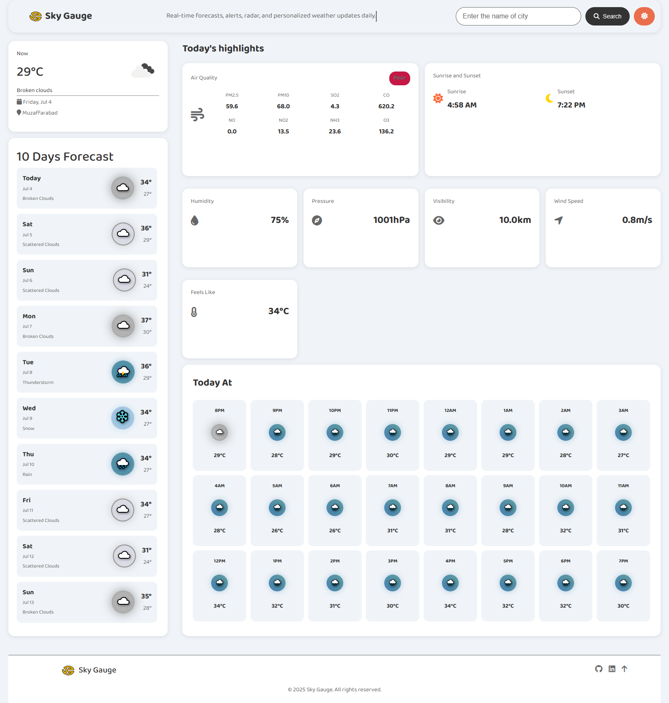

# Sky-Gauge

Sky-Gauge is a modern weather web app that fetches real-time weather data, 10-day forecasts, 24-hour hourly details, and air quality information using the [OpenWeatherMap API](https://openweathermap.org/). It features an engaging UI, emoji-based weather icons, accessibility features, and a smooth user experience.

## Features

- **Current Weather:** View real-time temperature, weather conditions, and location.
- **10-Day Forecast:** Visual 10-day weather forecast with icons and temperature trends.
- **24-Hour Hourly Forecast:** See hourly weather details for the next 24 hours.
- **Today's Highlights:** Sunrise, sunset, humidity, pressure, visibility, wind speed, and "feels like" temperature.
- **Air Quality Index (AQI):** Latest air quality status with detailed pollutants (PM2.5, PM10, SO2, CO, NO, NO2, NH3, O3).
- **Search by City:** Instantly get forecasts for any city worldwide.
- **Responsive Design:** Works on desktop and mobile.
- **Theme Switching:** Toggle between light and dark themes.
- **Accessibility:** Semantic HTML, ARIA labels, and keyboard navigation.

## Demo



## Installation

1. **Clone the repository:**
   ```bash
   git clone https://github.com/MuhammadGhyasAli/Sky-Gauge.git
   cd Sky-Gauge
   ```

2. **Get an OpenWeatherMap API key:**
   - Sign up at [OpenWeatherMap](https://openweathermap.org/appid).
   - Open `script.js` and replace `API_KEY` with your key.

3. **Open `index.html` in your browser.**

> No build step is required—this is a pure HTML/CSS/JS project.

## Usage

- Enter a city name in the search box and click "Search".
- The app will display:
  - Current weather and location
  - 10-day and 24-hour forecasts
  - Air quality and today's highlights
- Click the theme toggle for light/dark mode.

## Technologies

- HTML5, CSS3, JavaScript (ES6+)
- [OpenWeatherMap API](https://openweathermap.org/)
- [FontAwesome](https://fontawesome.com/) (for icons)
- [Google Fonts]((https://fonts.google.com/) (for fonts like "Baloo Bhai 2", sans-serif)

## Project Structure

```
/
├── index.html
├── script.js
├── style.css
├── logo.png
├── favicon.ico
├── screenshot.png
└── README.md
```

## Contributing

Contributions are welcome! Please open issues and submit pull requests for improvements or bug fixes.

1. Fork the repo
2. Create your feature branch
3. Commit changes and push to your fork
4. Open a pull request

## Contact

[](https://github.com/MuhammadGhyasAli)
[](https://www.linkedin.com/in/syed-ghyas-ali/)

---

© 2025 Sky Gauge. All rights reserved.
